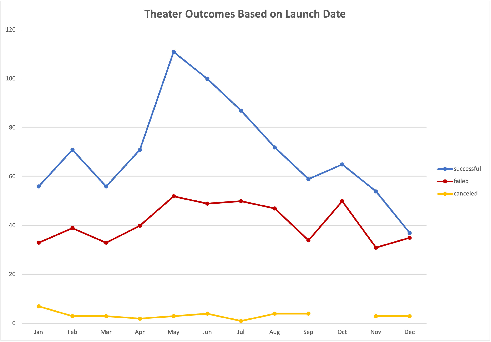
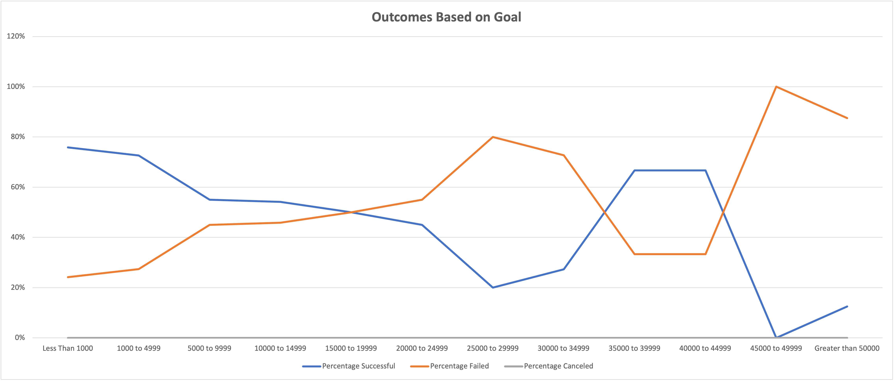

# Kickstarter Analysis (2009 - 2017 Data)

## Project Overview
Using data from the popular fundraising platform Kickstarter during the time period of 2009 to 2017, the scope of this project is to evaluate fundraising performance of similar projects to assure future success.

### Purpose
Louise had initiated a Kickstarter campaign on June 13th, 2016 to raise funds to develop and workshop a play titled "Fever". The initial goal was to raise $2,885 and although the campaign ultimately failed, she was able to gather $2,485 in pledges to support this effort. She has enlisted a data analytics professional to understand if there are any patterns or conditions that would help her be successful in attempting another campaign.

## Analysis and Challenges
The analysis was performed by Scott MacDonald on May 2nd, 2021. As with any data analysis, the primary challenge is integrity of the dataset. We are using data that is up to 12 years old with the most recent data in this population being nearly 4 years old. There is a possibility that conditions have changed either societally or economically that may impact the conclusions drawn and recommendations given as a result.

### Analysis of Outcomes Based on Launch Date
The data conclusively shows there is a better chance of success if the campaign is launched within the mid spring / early summer timeframe (May, June, or July). The success rate compared to the rest of the year for this time period is 35.5%. Louise had timed her campaign seasonally at just the right time to be successful starting her campaign on June, 13th. Chart Attached for reference:

### Analysis of Outcomes Based on Goals
The data also indicates the chance of success based upon the pledge goal amount is well positioned with nearly 3 out of 4 (75%) of the Plays successfully funded were had a goal of $4,999 or less. Louise had also positioned herself for a successful fundraising effort based upon historic Kickstarter data as her goal was to raise $2,885 and fell short of that goal by $400. Chart Attached for reference:

### Challenges and Difficulties Encountered
The primary challenge in this project is twofold; first, we don't know (and can't glean from the information provided), the gifts/rewards that are often enticements for individuals making pledges. Secondly, before she were to attempt another campaign we would want to make sure the data used to make these recommendations is still relevant by obtaining the most current data available to compare.

## Results

- **What are two conclusions you can draw about the Outcomes based on Launch Date?**
1- Louise timed the launch of her campaign during the timeframe most likely to succeed (mid spring to early summer) but I would recommend she start her next campaign the 4th week in April for maximum chance of success
2- The data from the chart shows that the success and failure trends largely mirror one another, meaning when the success goes up, the failures do too, and vice versa. This is an observable trend that differs in the months of May, June, July, and December.

- **What can you conclude about the Outcomes based on Goals?**
That plays seeking up to $4,999 or less were successfully funded 75% of the time. 

- **What are some limitations of this dataset?**
The age of the data is the primary concern with the analysis. Conditions may have changed or new trends may have emerged since this data was compiled.

- **What are some other possible tables and/or graphs that we could create?**
1- The average number of backers to a successful play seeking the amount less than $4,999 could be useful data as Louise could then see if any adjustments were necessary throughout the campaign to maximize the potential success.
2- We could also look at the affect of having a "Staff Pick" or "Spotlight" to see if those could have given her campaign more visibility to gain more backers.
3- It would also be helpful to know how she was promoting this campaign, Facebook, Twitter, e-mail, Google Ads, etc. Maybe there would have been a lot more backers than 10 if a lot more people could be made aware of and inspired by her vision for the play.